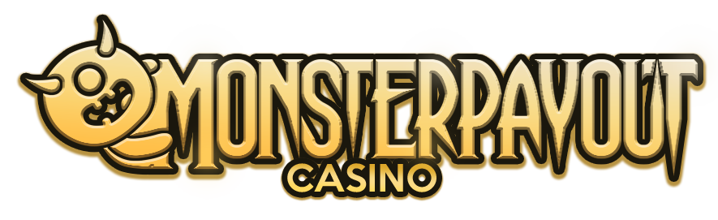

Implemented in Metropolia's software production project course.

MonsterPayout is a virtual casino that includes both paid casino games and free arcade games. Casino games are games where the casino's paid currency (credits) are used for gambling. Arcade games can be played either for free or by using the casino's free currency (coins) as a bet. It is possible for the player to exchange coins for credits using the in-program trade. This is what makes MonsterPayout unique, allowing players to play casino games for free.

You can find the final documentation written in Finnish from here: [Toteutusdokumentti.pdf](https://github.com/Samucl/MonsterPayout/blob/main/doc/MonsterPayout%20toteutusdokumentti.pdf) .

## Features

	- User accounts
	- User details
	- 7 games
	- Store
	- Store manager
	- 2 languages (Finnish and English)
	
## Technologies used in developement

	- JavaFX & Scenebuilder
	- MariaDB
	- Apache Maven
	- JUnit5
	- Eclipse Workspace
	- Abobe Photoshop

## Installation

Java compiler version 15 or higher is required

The Maven build system we use contains a dependency for a MariaDB JDBC driver. So first install and enable MariaDB.

**https://mariadb.org/download**

Clone the repository with git

```sh 
git clone https://github.com/Samucl/MonsterPayout

```

In the root directory of the project there is a sql script called "db.sql" which you need to import to create the database and all the necessary tables.

`MariaDB [(none)]> SOURCE <path/to/project/root/db.sql>;`

In the root directory of the project there is also a config.properties file, where you have to edit the username and password of your database account.

> db.URL=jdbc:mariadb://localhost:3306/kasino \
> db.username=root \
> db.password=root

Import the project into a IDE of your choice  **(e.g. Eclipse)**

The program is executed from the Launcher.java class
> (src/main/java/monsterpayout.app/Launcher.java).

## Contributors
[](https://github.com/Samucl)
[](https://github.com/Jukk1s)
[](https://github.com/eljash)


## Screenshots

<table>
  <tr>
  	<td align="center">
      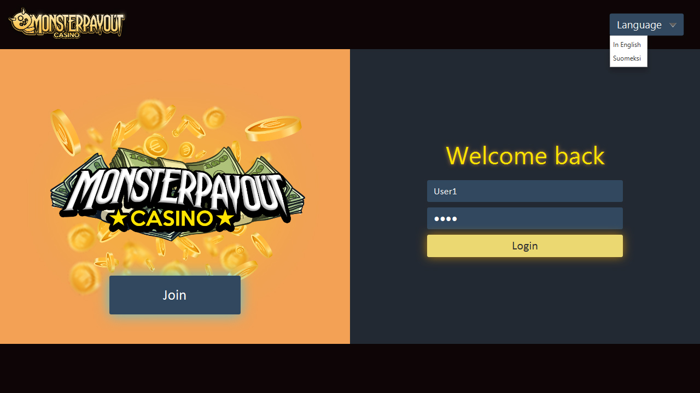
    </td>
    <td align="center">
      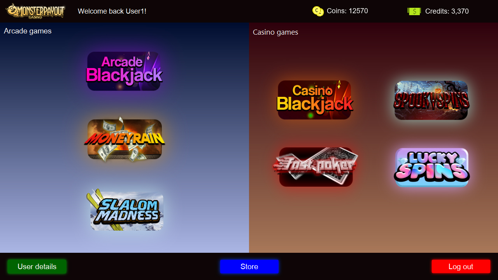
    </td>
  </tr>
  <tr>
  	<td align="center">
      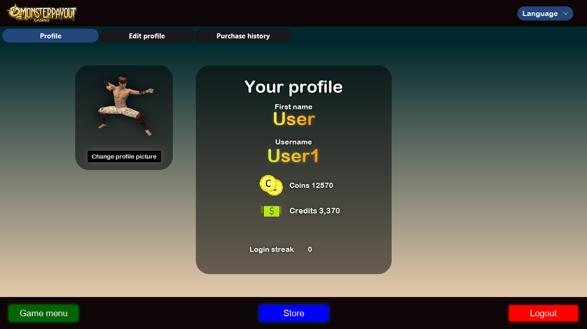
    </td>
    <td align="center">
      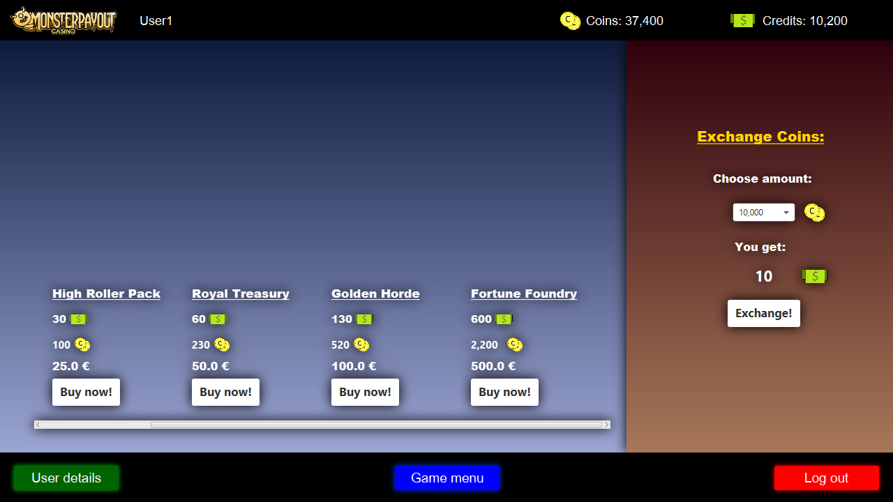
    </td>
  </tr>
  <tr>
    <td align="center">
      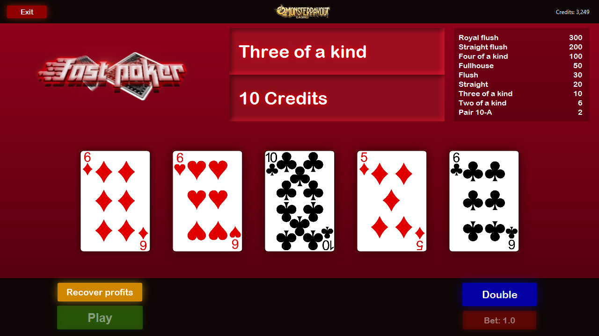
    </td>
    <td align="center">
      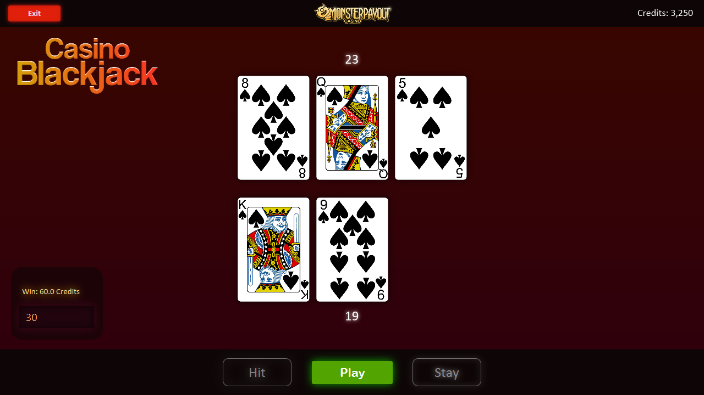
    </td>
  </tr>
  <tr>
  	<td align="center">
      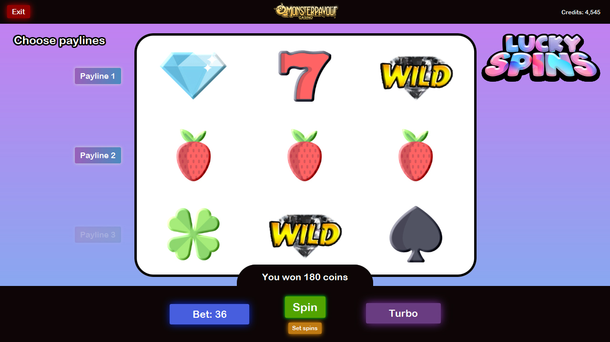
    </td>
    <td align="center">
      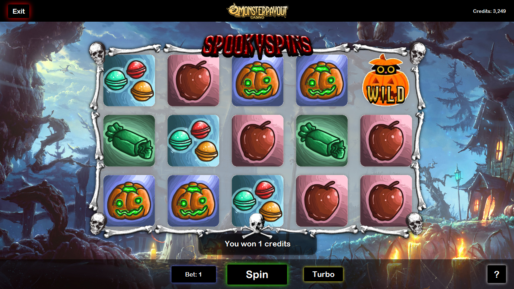
    </td>
  </tr>
  <tr>
  	<td align="center">
      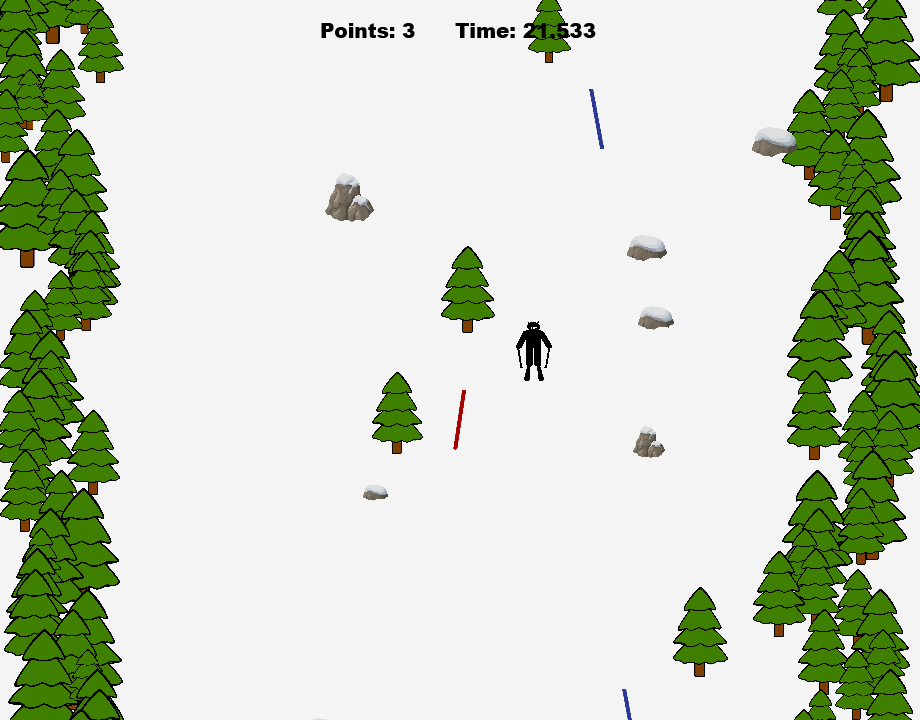
    </td>
    <td align="center">
      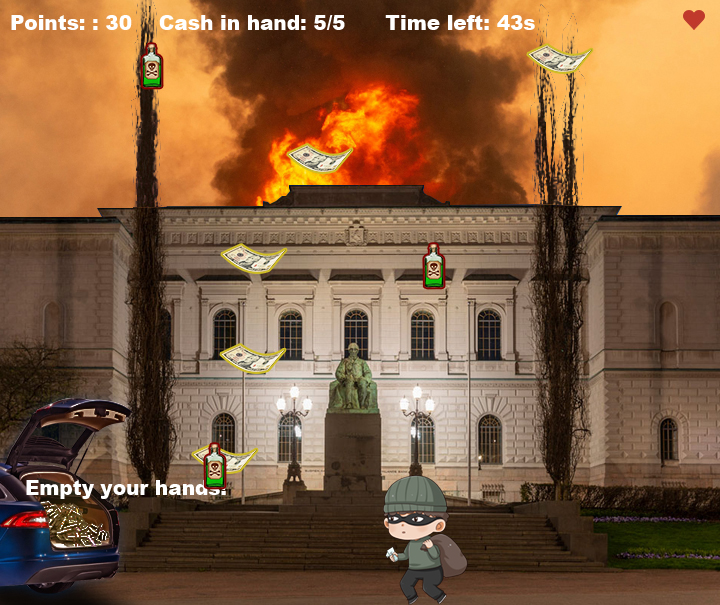
    </td>
  </tr>
</table>
